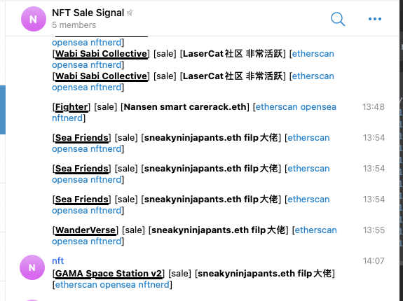

# NFT_Bot
Monitor NFT address trading and send notifications to Telegram


# Run
> python3.8 nft_scan.py 

```commandline

/Users/adam/Code/NFT_Bot/venv/bin/python /Users/adam/Code/NFT_Bot/nft_scan.py
2022-03-08 15:41:58,695 - nft_scan.py[line:69] - INFO: queue BLOCK_NUMBER is empty 
2022-03-08 15:41:58,695 - nft_scan.py[line:83] - INFO: queue QUEUE_TX is empty 
2022-03-08 15:41:59,699 - nft_scan.py[line:83] - INFO: queue QUEUE_TX is empty 
2022-03-08 15:41:59,699 - nft_scan.py[line:69] - INFO: queue BLOCK_NUMBER is empty 
2022-03-08 15:41:59,718 - nft_scan.py[line:46] - INFO: put new block number 14344928 to queue
2022-03-08 15:42:00,704 - nft_scan.py[line:83] - INFO: queue QUEUE_TX is empty 
2022-03-08 15:42:01,710 - nft_scan.py[line:83] - INFO: queue QUEUE_TX is empty 
2022-03-08 15:42:01,908 - libs.py[line:43] - INFO: 14344928 - 14344928  NFT txs: 141
2022-03-08 15:42:01,908 - nft_scan.py[line:69] - INFO: queue BLOCK_NUMBER is empty 
2022-03-08 15:42:02,913 - nft_scan.py[line:69] - INFO: queue BLOCK_NUMBER is empty 
2022-03-08 15:42:03,719 - nft_scan.py[line:83] - INFO: queue QUEUE_TX is empty 
2022-03-08 15:42:03,918 - nft_scan.py[line:69] - INFO: queue BLOCK_NUMBER is empty 
```

# Screenshot

